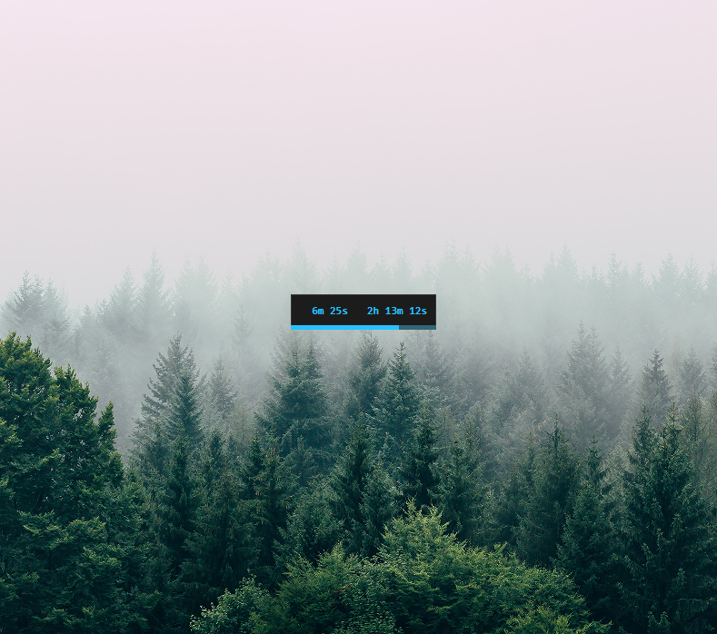

# pom

Minimal pomodoro timer app

# DESCRIPTION

Pom is a minimal pomodoro timer app for desktop.  
It's made with vanilla JavaScript + Neutralino, so its size is only 2.5 megabytes.  
The app is meant to be always on top; that's why it doesn't have a window frame.  
Always on top can be toggled by pressing A.  
The app is also draggable; just click anywhere on it and drag it.

# BUT...WHY?

A pomodoro timer makes you more productive by:  
.Encouraging you to strongly focus for a limited period.  
.Reminding you to take breaks to rest your eyes and brain, and avoid sedentarism.  
.Enabling more efficient problem solving by distracting the brain, and thus helping come up with new angles.  
..Even better if you do mini workouts!

# FUNCTIONALITY

The app has 3 modes: Pomodoro, Breaks, Totals  
-Pomodoro (blue): it shows a 25-minute timer on the left, and a stopwatch of the total productivity of the day, on the right.  
-Breaks (orange): it shows a 5-minute stopwatch on the left, and a stopwatch of the total breaks of the day, on the right.  
-Totals (blue and orange): it shows the total productivity of the day on the left, and the total breaks on the right.

The app's border flashes when you worked/rested enough.  
That encourages you to change the mode between Pomodoro <--> Breaks

# RUNTIMES

This JavaScript app is packaged by Neutralino, which currently builds for these platforms:  
-Windows x64  
-Mac ARM / Universal / x64  
-Linux x64 / ARM64 / ARMHF

Status:
-The app runs properly on Windows.  
-It hasn't been tested on Linux.  
-It has been tested on Mac ARM and it currently has a few issues. See 'Known Issues' below.

# INSTALLATION

-Clone the repo.  
-Install node and npm.  
-Install Neutralino (the app's framework)  
.Usually: npm install -g @neutralinojs/neu  
..But check Neutralino's documentation for the latest instructions: https://neutralino.js.org/docs/getting-started/your-first-neutralinojs-app  
-cd to the repo.  
-Initialize the repo with: neu update  
.That adds neutralino.js to the project, along with the necessary binaries to bin/  
-Run the app in dev mode with: neu run  
-Build the app with: neu build --release  
-Install the app locally by copying these two files to your desired directory:  
.dist/pom/pom-win_x64.exe (or the one relevant for your OS)  
.dist/pom/resources.neu  
-The DevTools inspector window will open by default, so that you can debug or change the CSS.  
.You can change this behaviour in neutralino.config.json (setting enableInspector to false).

# CONTROLS

As the app is so minimal, all the controls are single keys, or mouse based.  
Remember to click on the app before using the keyboard commands:  
A: toggle always on top  
D: open app directory  
F: pause and switch to Totals view  
G and P: toggle play/pause  
M: minimize  
Mouse left click (hold): drag app  
Mouse wheel: change time of hovered clock  
Q: save state and quit  
R: reset hovered clock (resets app if pressed in Totals view)  
Spacebar and S and Double click: switch views (Pomodoro/Breaks)  
T: toggle dark/light theme

# KNOWN ISSUES

WINDOWS ISSUES  
-None.

LINUX ISSUES  
-Not tested yet.

MAC ISSUES  
-On the first run, only the progress bar is visible.  
.That's likely because Mac doesn't get along with the small window size (135x60 pixels) in combination of a borderless app.  
.The solution is to edit neutralino.config.json so that the window is resizable and not borderless, then run the app and resize the window. That new size will always be used, as apparently Mac doesnt allow resizing from code, so the width and height in the config will never be used by the OS.  
-If the window is borderless, the keyboard commands won't work.  
.The issue is mentioned here https://github.com/neutralinojs/neutralinojs/issues/1197  
..Someone suggests the solution is to create a transparent layer or something.  
-When dragging the app (by clicking inside the app), the CSS 'user-select:none' is ignored, so the clock's text will be selected for an instant.  
-Pressing a key on the app triggers a sound (one beep every time a key is pressed).  
-Adjusting a clock using the mouse wheel may step multiple minutes (instead of a single minute) if the user is running an app that fixes/improves the mouse scrolling on Mac (like "Mac Mouse Fix").

# TIPS

When the app first starts, it boots in Pomodoro mode, and paused.  
You can tell it's paused because the clocks are grey.  
So press G or P to toggle play.  
From then on, you don't need to toggle play; just switch between Pomodoro and Breaks.  
When you're done for the day, press F, which pauses the clocks and takes you to the Totals view.  
The next day, press R in the Totals view to reset the app.  
Then press Space to go to the Pomodoro view.
